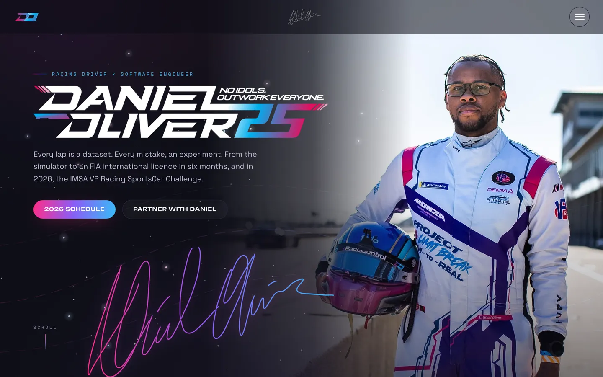
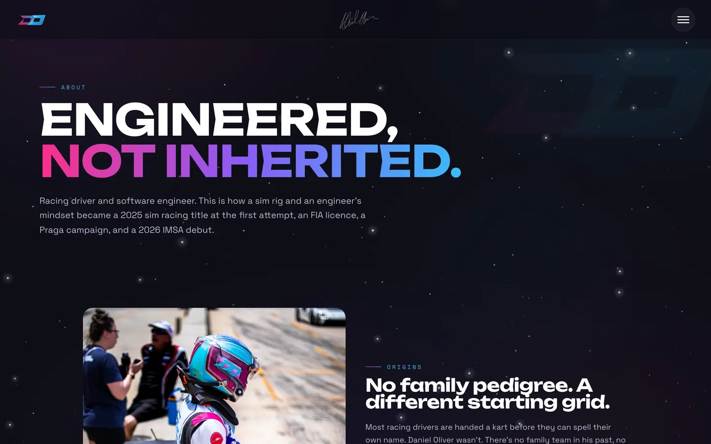
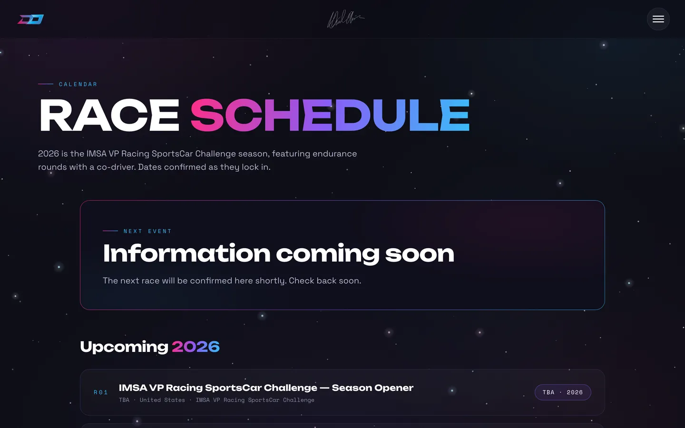
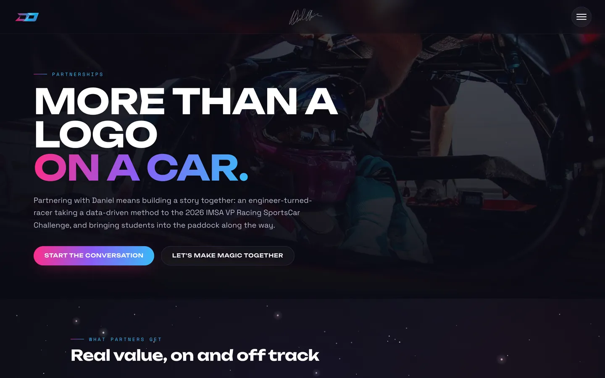

# Daniel Oliver Racing

Personal site for racing driver **Daniel Oliver** — a fast, static, animation-rich site with a
built-in content editor. Built with **Astro 5** + **Tailwind CSS 4**, content managed via
**Decap CMS**, hosted on **Netlify**.

**Live:** <https://danieloliverracing.com>

> No idols. Outwork everyone.



<table>
  <tr>
    <td></td>
    <td></td>
  </tr>
  <tr>
    <td></td>
    <td valign="top">

**Highlights**
- Animated hero with a real signature write-on
- Site-wide galaxy starfield + aurora ambience
- Car-swipe page transitions
- Circuit outline maps + country flags
- Everything editable from `/admin` — no code

  </td>
  </tr>
</table>

<p align="center">
  <br />
  <sub>The signature draws itself on — one traced SVG path + a moving CSS mask. See
  <a href="docs/SIGNATURE.md">docs/SIGNATURE.md</a> to use your own.</sub>
</p>

📝 **Just want to edit content?** Jump to [Editing content](#editing-content) or read the plain-English
guide in **[docs/EDITING.md](docs/EDITING.md)**.

## Stack

- [Astro 5](https://astro.build) — static output, content collections (glob loaders + zod schemas)
- [Tailwind CSS 4](https://tailwindcss.com) — via `@tailwindcss/vite`, theme in `src/styles/global.css`
- [Decap CMS](https://decapcms.org) — the `/admin` editor, git-based (commits straight to the repo)
- Vanilla JS + CSS only for motion (View Transitions, scroll reveals, the signature write-on,
  starfield/aurora ambience, car-swipe transitions) — no client-side framework

## Local development

```bash
npm install
npm run dev          # site → http://localhost:4642  (custom port, not 4321)
npm run build        # production build → dist/
npm run preview      # serve the production build
```

## Editing content

Everything user-facing is CMS-editable — pages read from `src/data/**` and `src/content/**`, with
**no hardcoded copy**. You never have to touch code to change words, images, events, or posts.

Two ways to edit:

- **Locally, with live preview (no login):**

  ```bash
  npm run edit       # starts the editor + the live site together
  ```

  Open **http://localhost:4642/admin** (editor) and **http://localhost:4642** (site). Every **Save**
  hot-reloads the site tab, so you see the real, styled result as you type. Commit + push to publish.

- **From any browser (logged in):** open `/admin` on the live site and sign in. Edits are saved as
  drafts you can review, then Publish.

Full field-by-field walkthrough: **[docs/EDITING.md](docs/EDITING.md)**.

### Content model

| Collection | Location | Notes |
|---|---|---|
| Blog / News posts | `src/content/posts/*.md`, `src/content/news/*.md` | title, date, excerpt, cover, tags, track, draft, body |
| Galleries | `src/content/galleries/*.json` | title, date, location, cover, images[] |
| Events | `src/content/events/*.md` | circuit, series, `status`, `result` (P1/P2/P3 → medal), track, link |
| Site settings | `src/data/site.json` | name, tagline, nav, socials, sponsors, footer, brand logos |
| Pages | `src/data/pages/*.json` | per-page copy + images (home, about, media, blog, schedule, partnerships, contact, 404) |

Images live in `public/images/`; CMS uploads go to `public/images/uploads`.

## Deployment

The site is live on Netlify. **Deploys are manual via the Netlify CLI — there is no CI, and pushing
to GitHub does _not_ publish the site:**

```bash
npm run build
netlify deploy --prod --dir=dist
```

This builds locally and uploads `dist/` (no CI minutes used). Because it's manual, **CMS edits merged
to the main branch don't go live until someone runs the command above.** (You can instead connect the
repo in Netlify's UI for automatic Git-based builds — not currently enabled.)

## Validating changes (Playwright)

The site leans on animation and precise image cropping, so regressions are visual. Rather than eyeball
every page, the repo ships **Playwright-driven checks** you run against a local dev server (port 4642):

```bash
npm run dev            # in one terminal

npm run verify:hero    # asserts the hero text never overlaps the driver's face (9 viewports)
npm run verify:reveals # asserts every scroll-reveal image actually appears (no stuck-hidden sections)
npm run verify:a11y    # runs axe-core accessibility checks and fails on violations
```

Use them as a pre-commit gate — if you tweak the hero, layout, or motion, run the relevant check and
confirm it passes before you push. They're plain Node scripts in `scripts/`, easy to extend with new
assertions as you add sections.

Regenerate the README screenshots (captures the live site with reduced motion for clean stills):

```bash
npm run screenshots                                  # defaults to the live domain
BASE=http://localhost:4642 npm run screenshots       # or a local build
```

## Project structure

```
src/
  components/   Header, Footer, Signature (real autograph write-on), GalaxyField,
                AmbientAurora, CarWipe, TrackMap, Flag, Lightbox, SocialLinks
  layouts/      BaseLayout.astro — SEO/structured data/fonts + the site-wide motion runtime
  pages/        index, about, media(+[slug]), blog(+[slug]), news(+[slug]),
                schedule, partnerships, contact, 404
  content/      posts/, news/, galleries/, events/  (Astro collections)
  data/         site.json, pages/*.json (CMS-editable copy), tracks.json, signature.json
  styles/       global.css (Tailwind 4 @theme design system)
public/
  admin/        Decap CMS (index.html + config.yml)
  images/       hero/, galleries/, sponsors/, brand/, flags/, 2026/, uploads/
scripts/        Playwright verification + screenshot/GIF tooling
docs/           EDITING.md, SIGNATURE.md, SEARCH-CONSOLE.md, screenshots/
```

Deeper architecture notes, gotchas, and the go-live checklist live in **[AGENTS.md](AGENTS.md)**.

## Use this as a template for your own site

This is a solid starting point for any driver/athlete/personal brand: fast static pages, a real CMS,
and a distinctive motion system — with nothing to run but Node and Netlify. To make it yours:

1. **Fork / use as a template**, then `npm install` and `npm run dev`.
2. **Point the CMS at your repo.** In `public/admin/config.yml`, change `backend.repo` to your own
   `owner/repo`. That, plus your Netlify site, is all the CMS needs — it commits content to your repo.
3. **Rebrand.** Edit `src/data/site.json` (name, tagline, socials, colors) and swap the design tokens
   in `src/styles/global.css`. Replace the logo/favicon in `public/`, and drop in your own
   handwritten signature — [docs/SIGNATURE.md](docs/SIGNATURE.md) walks through tracing it to the
   animated mark.
4. **Replace the content.** Edit `src/data/pages/*.json` for copy, drop your own posts in
   `src/content/**`, and put your images in `public/images/` (or upload via `/admin`).
5. **Set your domain.** Update `site` in `astro.config.mjs` and the URLs in
   `public/admin/config.yml` and `public/robots.txt` to your domain.
6. **Deploy** with the Netlify CLI (see [Deployment](#deployment)), then follow
   [docs/SEARCH-CONSOLE.md](docs/SEARCH-CONSOLE.md) for search indexing.
7. **Validate** with the Playwright checks above as you customize.

> **Please note:** the *code* is a fair template to learn from and adapt, but the **name, likeness,
> photography, signature, and branding of Daniel Oliver are not** — replace all content and imagery
> with your own before publishing. No license is granted to reuse Daniel's personal assets.
